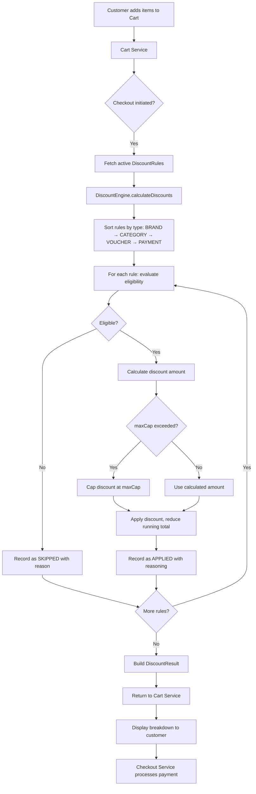

# Architecture

## Service Boundaries

In a production system, the discount platform would be a separate bounded context with clear API boundaries. For this implementation, we focus on the core calculation engine only.

```
┌─────────────────────────────────────────────────────────────────┐
│                        Client / Checkout UI                     │
└──────────────────────────────┬──────────────────────────────────┘
                               │ POST /cart/calculate-price
                               ▼
┌─────────────────────────────────────────────────────────────────┐
│                         Cart Service                            │
│  - Manages cart state (items, quantities)                       │
│  - Calls Discount Service before checkout                       │
└──────────────────────────────┬──────────────────────────────────┘
                               │ calculateDiscounts(cart, rules)
                               ▼
┌─────────────────────────────────────────────────────────────────┐
│                      Discount Service ← THIS REPO              │
│                                                                 │
│  ┌──────────────┐    ┌──────────────────┐    ┌──────────────┐  │
│  │ Rule Loader   │───▶│  DiscountEngine  │───▶│ DiscountResult│ │
│  │ (in-memory)   │    │  (core logic)    │    │ (output)      │ │
│  └──────────────┘    └──────────────────┘    └──────────────┘  │
│                                                                 │
│  Responsibilities:                                              │
│  - Evaluate eligibility of each rule against the cart           │
│  - Apply discounts in priority order (BRAND→CAT→VOUCHER→PAY)   │
│  - Enforce caps, exclusions, min cart value                     │
│  - Return itemized breakdown with reasoning                    │
└──────────────────────────────┬──────────────────────────────────┘
                               │ DiscountResult
                               ▼
┌─────────────────────────────────────────────────────────────────┐
│                       Checkout Service                          │
│  - Receives final price + discount breakdown                    │
│  - Processes payment via Payment Gateway                        │
│  - Stores order with applied discounts for audit                │
└─────────────────────────────────────────────────────────────────┘
```

## Data Flow Diagram (Mermaid)



## Key APIs (High-Level Contracts)

### DiscountEngine
```
Input:  Cart (items + payment context) + List<DiscountRule>
Output: DiscountResult (finalPrice, totalDiscount, appliedDiscounts[], reasoning)
```

### Cart Service → Discount Service
```
POST /discounts/calculate
Request:  { cart: Cart, appliedVoucherCode?: string }
Response: { originalPrice, finalPrice, totalDiscount, discounts: AppliedDiscount[] }
```

### Discount Rule Management (future)
```
GET    /rules                    — list active rules
POST   /rules                    — create a new rule
PUT    /rules/{id}               — update a rule
DELETE /rules/{id}               — deactivate a rule
GET    /rules?type=BRAND         — filter by type
```

## Where Rules Live

In this implementation: in-memory, passed directly to the engine.

In production, rules would be stored in a database (e.g., DynamoDB or PostgreSQL) and loaded by a Rule Loader service. Rules could be cached with a short TTL for performance. An admin UI would manage rule CRUD operations.

## Design Decisions

1. **Single DiscountRule class vs. polymorphic hierarchy**: With only 4 types, a single class with optional fields is simpler and more maintainable than an abstract class tree. If types grow beyond ~8, consider refactoring to a Strategy pattern.

2. **Fixed application order via enum ordinal**: Simple and predictable. If business needs require dynamic ordering, this can be replaced with a priority field on the rule.

3. **Immutable models**: All domain objects are records or have defensive copies. This prevents subtle bugs from shared mutable state during discount calculation.
